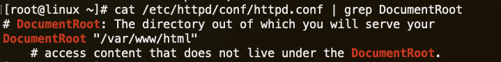
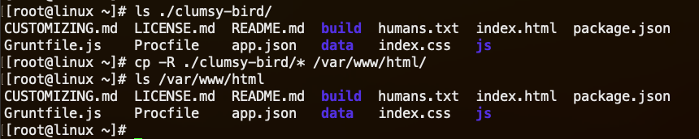
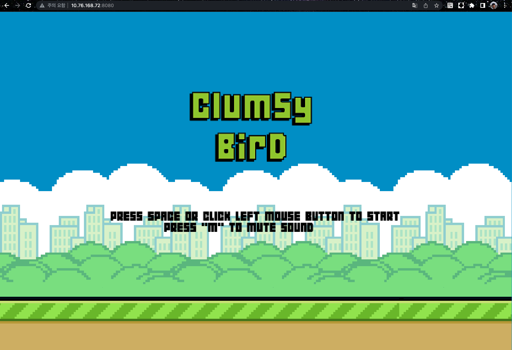
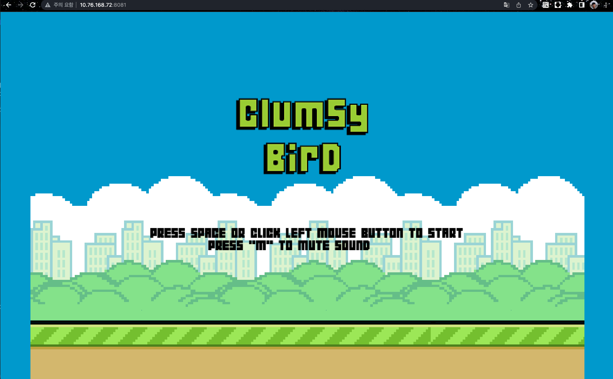

## Account Day Workshop - Container Demo

컨테이너 기술의 특징을 확인하고, 가상머신 환경과의 차이점을 


```
목차
1. Apache 웹 서버 (HTTPD) 설치 - [기능비교] 별 차이 없고 쉬움
2. 어플리케이션 배포 - [기능비교] 별 차이 없고 쉬움
3. 웹서버 버전 업그레이드 - [장점] - 
4. 웹서버 버전 롤백 - [장점]
5. 완성된 서비스 공유 (goldenimage vs FileSystem vs container) - [하이라이트] 확장성/이식성 뛰어남
```

<br/>

### 1. Apache 웹 서버 (HTTPD) 설치
---

Apache 웹 서버를 RHEL OS와 컨테이너에 각각 구성해보면서 각각의 특징 및 차이점을 확인합니다.


**1-1) 가상머신 기반 리눅스에 httpd 설치**


RHEL 7 리눅스 운영체제에서 패키지 관리자 도구인 yum을 통해 httpd 서비스를 설치합니다.

```bash
$ yum install -y httpd-2.4.6-40.el7.x86_64
```


Apache 웹 서버인 httpd 데몬의 서비스 포트를 8080으로 변경합니다.

```bash
$ sed -i 's/Listen 80/Listen 8080/g' /etc/httpd/conf/httpd.conf
```

Apache 웹 서버인 httpd 서비스를 활성화하고 기동합니다. 

```bash
$ systemctl enable httpd
$ systemctl start httpd
```

웹 페이지를 호출하여 서비스 상태를 확인합니다.


**1-2) httpd 컨테이너를 사용하여 기동**


Red Hat에서 제공하는 검증된 httpd 이미지를 다운로드 받습니다. 
podman pull 명령어로 다운로드를 진행합니다.

```bash
$ podman pull registry.redhat.io/rhel8/httpd-24:1-160
$ podman images
```

다운로드 받은 httpd 이미지를 실행하여 웹 서버 서비스를 확인합니다.

```bash
$ podman run -d --name httpd -p 8081:8080 registry.redhat.io/rhel8/httpd-24:1-160
$ podman ps
```

웹 페이지를 호출하여 서비스 상태를 확인합니다.


**1-3) 요약 - 웹 서버 설치시 특징**

일반적인 가상머신의 OS 환경과 컨테이너 환경에서 웹 서버 구성의 시간 차이는 별로 나지 않았습니다.  

  
<br/>

### 2. 애플리케이션 배포
---

간단한 웹 페이지 기반의 게임 애플리케이션을 웹서버에 배포하여 서비스를 확인합니다. 
Git 소스에 있는 개발 소스를 로컬에 다운로드 합니다.

```bash
$ git clone https://github.com/ellisonleao/clumsy-bird/
$ ls ./clumsy-bird/
```

**2-1) 가상머신 기반 리눅스의 httpd 웹 서버에 APP 배포**

다운로드 받은 게임 소스를 웹 서버가 바라보는 애플리케이션 디렉터리 위치로 복사합니다.

```bash
# 애플리케이션 소스 위치 확인
$ cat /etc/httpd/conf/httpd.conf | grep DocumentRoot

# 애플리케이션 소스 복사 
$ ls ./clumsy-bird/
$ cp -R ./clumsy-bird/* /var/www/html/
$ ls /var/www/html
```

*Apache 웹 서버의 DocumentRoot 설정 확인*


*애플리케이션 복사*


애플리케이션 복사가 완료되었으면, 웹 브라우저에서 게임 서비스를 확인합니다.


**2-2) httpd 컨테이너에 APP 배포**

기존에 서비스하던 httpd 컨테이너를 중지하고, httpd-game 이라는 새로운 컨테이너를 기동합니다.

```bash
$ podman stop httpd
$ podman run -d --name httpd-game -p 8081:8080 -v /root/clumsy-bird:/var/www/html:Z registry.redhat.io/rhel8/httpd-24:1-160
```

웹 브라우저에서 게임 서비스를 확인합니다.




**2-3) 요약 - 웹 어플리케이션 배포시 특징**


<br/>


### 3. 웹서버 버전 업그레이드
---

<br/>

---
### 4. 웹서버 버전 롤백

<br/>

---
### 5. 완성된 서비스 공유 (goldenimage vs FileSystem vs container) 


